# Penjelasan
### 1. buka xampp
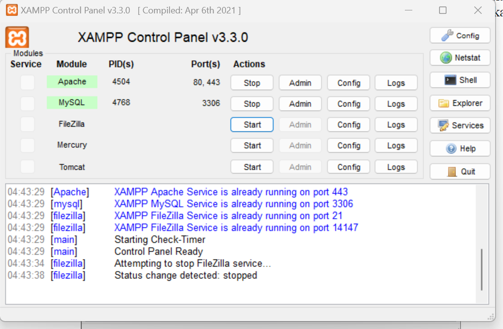

### 2. buat database
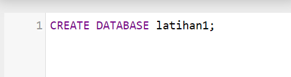

### 3. kelola database
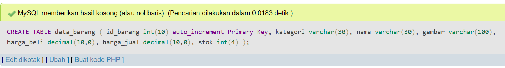
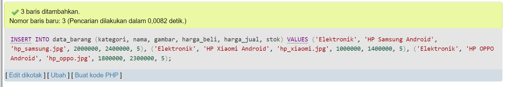

### 4. buka web

### 5. koneksi.php
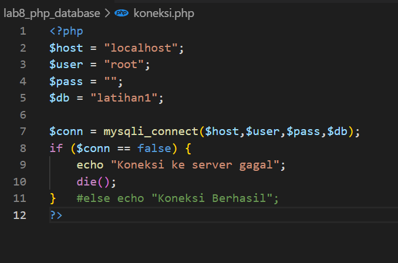
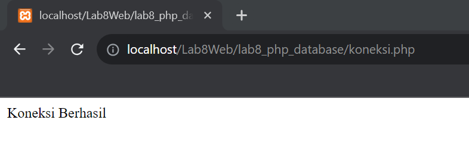

### 6. index.php
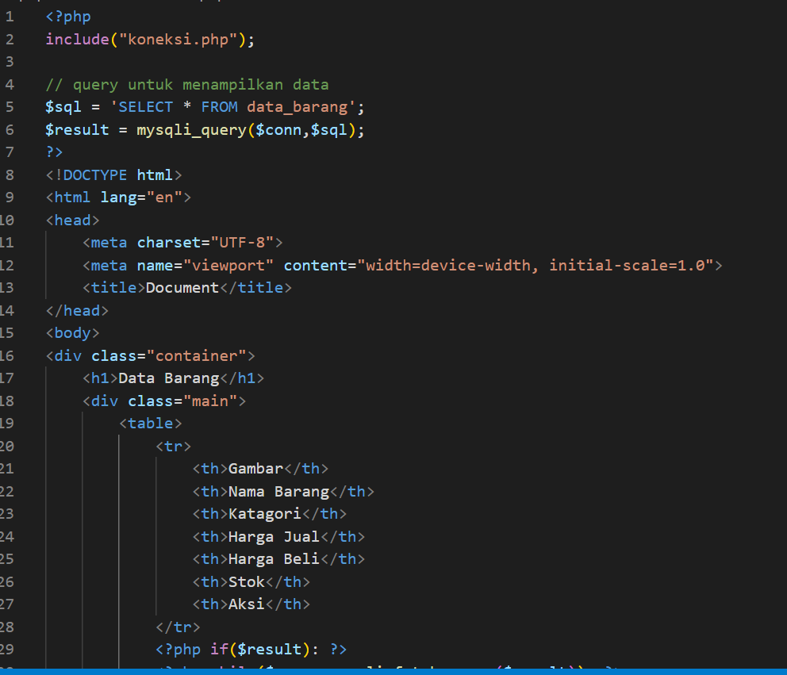
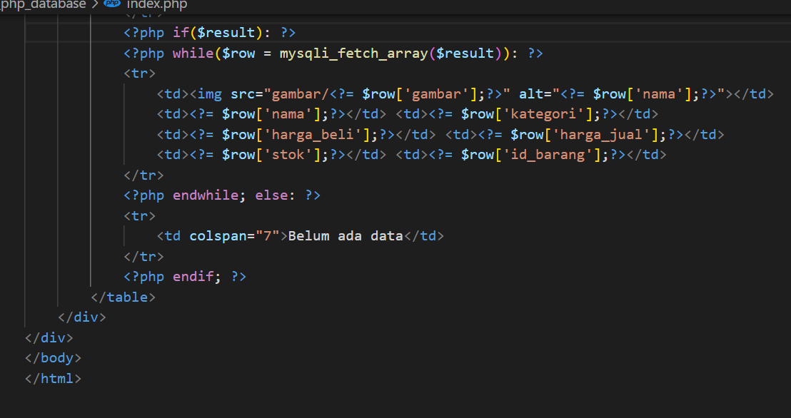
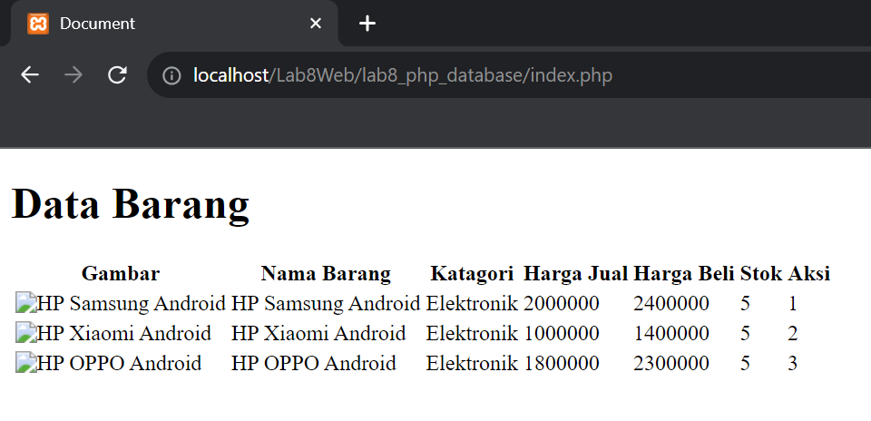

### 7. tambah.php
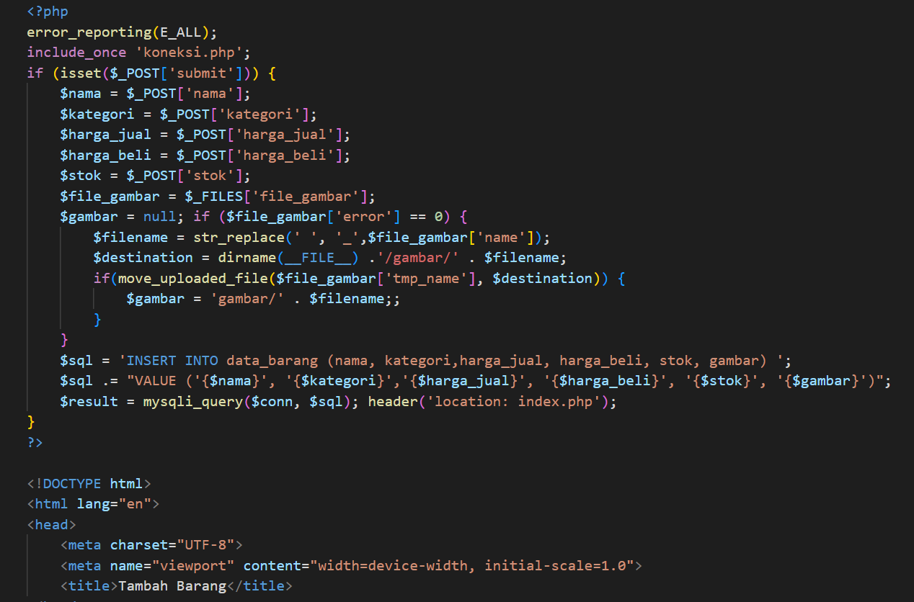

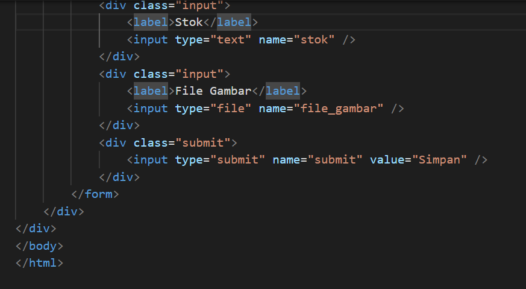
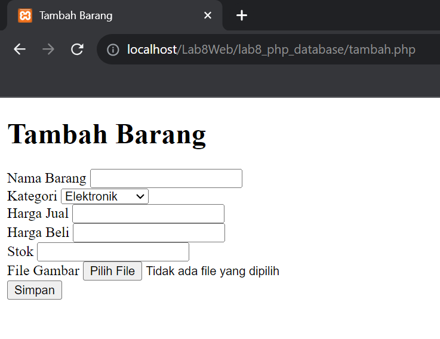

### 8. ubah.php
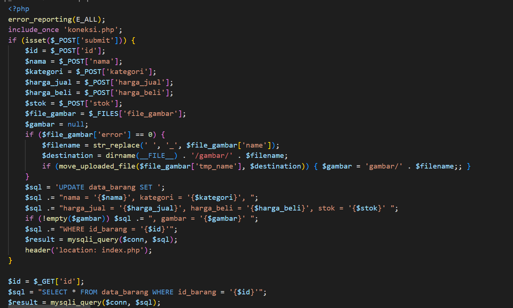
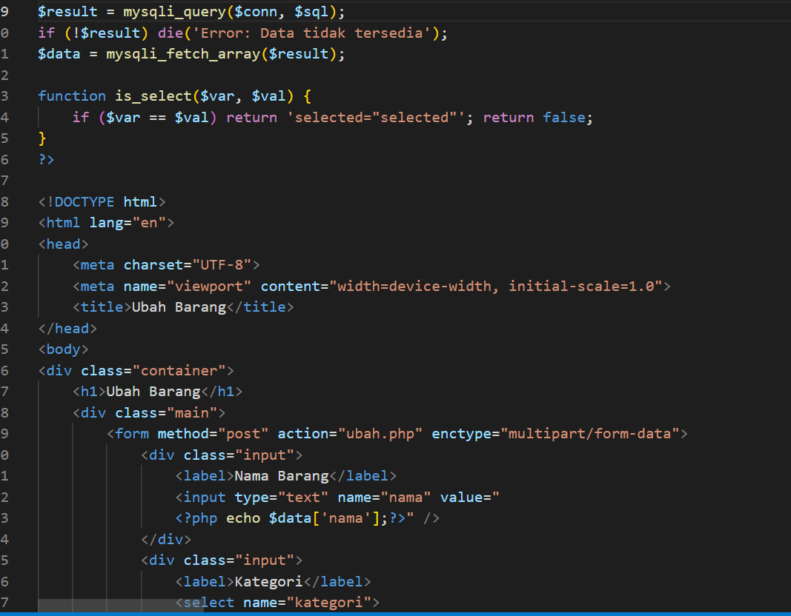
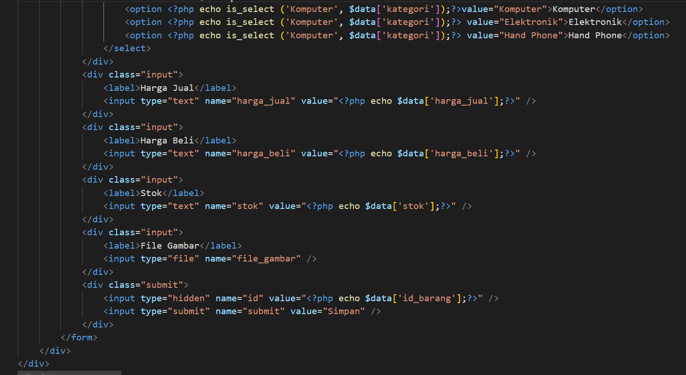

### 9. hapus.php
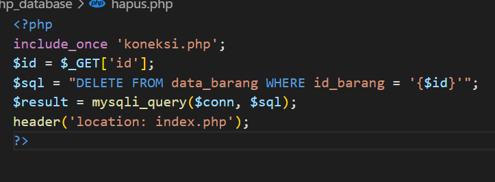
